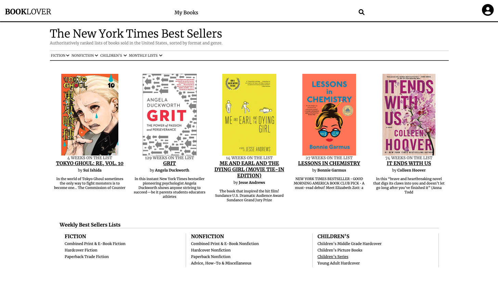
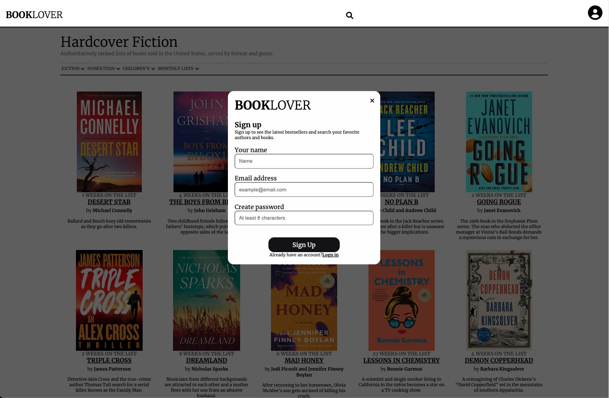
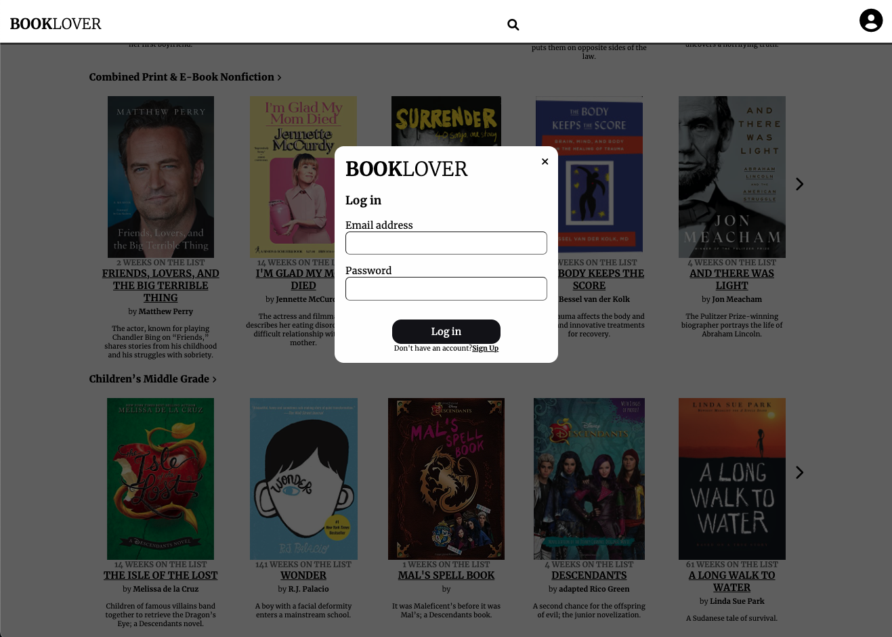
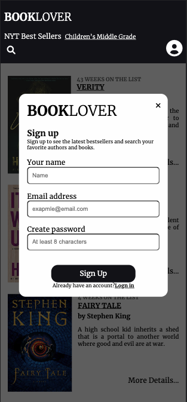
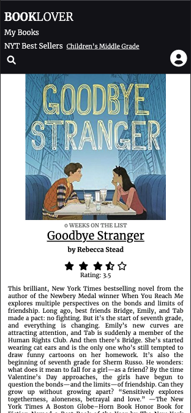
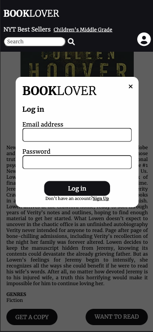

# BookLover
My application is for people who enjoy reading. 
I wanted to combine search for books with recommendations from NYTimes Best Sellers.

### Using this application, user can:
- view current best selling books by different categories
- search books by title, author or keyword
- create an account with a email and password, sign in and out of their account
- add book to "my books" list and remove it
- get a copy from Amazon or Google Play
___

### Technologies Used
- React.js
- PostgreSQL
- Webpack
- Node.js
- Express
- Babel
- HTML5
- CSS3
___ 

### This application was build querying two different APIs
- [NYTimes The Books API](https://developer.nytimes.com/docs/books-product/1/overview) used for query bestsellers by category
- [Google Books APIs](https://developers.google.com/books/docs/overview) used for full description and search feature 

### Preview 
<p align="middle">
  
</p>
My Books Page
<p align="middle">
  
</p>
Sign Up Modal
<p align="middle">
  
</p>
Log In Modal
<p align="middle">
  
</p>
<p align="middle">
  
  
  
</p>


### Try the application live [here](http://book-lover-app.yuliia.net/)

____

# Development

### System Requirements
- Node.js 10 or higher
- PostgreSQL

### Getting Started 
1. Clone the repository.
```
git clone https://github.com/yuliia-p/BookLover
cd BookLover
 ```
2. Install all dependencies with NPM.
```
npm install
```
3. Copy the .env.example into .env with your own API keys and database url
```
cp .env.example .env
```
4. Create a new database with PostgreSQL
```
createdb databaseName
```
5. Import the example database to PostgreSQL
```
npm run db:import
```
6. Build main.js script with npm.
```
npm run build
```
7. Start the application. You can view the app by opening [http://localhost:3000](http://localhost:3000/) in your browser.
```
npm run dev
```
