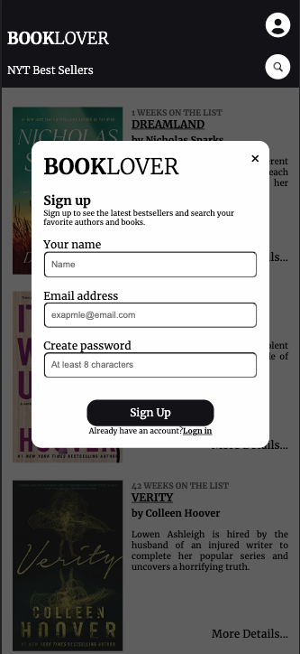
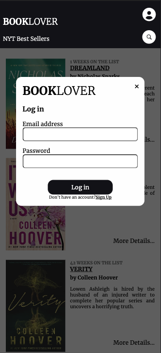

# BookLover
A web application for people who enjoys reading. 
I wanted to combine search for books with recommendations from NYTimes Best Sellers.

### Using this application, user can:
- view current best selling books by different categories
- search books by title, author or keyword
- create an account with a email and password, sign in and out of their account
- add book to "my books" list and remove it
- get a copy from Amazon or Google Play
___

### Technologies Used
- React.js
- PostgreSQL
- Webpack
- Node.js
- HTML5
- CSS3

___ 

### This application was build querying two different APIs
- [NYTimes The Books API](https://developer.nytimes.com/docs/books-product/1/overview) used for query bestsellers by category
- [Google Books APIs](https://developers.google.com/books/docs/overview) used for full description and search feature 

### Preview 

  

  
  
  

### Try the application live [here](http://book-lover-app.yuliia.net/)
____

## Development

#### System Requirements
- Node.js 10 or higher
- NPM 6 or higher
- PostgreSQL
